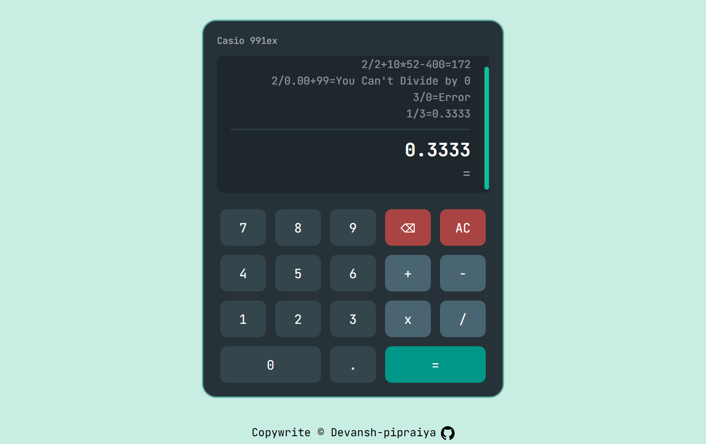

# 🧮 Interactive Calculator

### A fully-featured calculator with history, keyboard support, and edge cases error handling — built with vanilla JS.

Final project of **[The Odin Project](https://www.theodinproject.com/about)** Foundations course — built with pure **HTML**, **CSS**, and **JavaScript**, no libraries, no frameworks.

Handles _chained calculations_, _decimals_, _backspace_, _keyboard input_, a _history log_, and many Math and other edge cases like _divide-by-zero_ and _consecutive operator handling_ etc.

---

> 📌 **Project status:** Completed ✅ | 🌐 [Live Preview](https://devansh-pipraiya.github.io/calculator/)

---

## ✨ Features

- 🔢 **Basic Operations** — with **left-to-right sequential evaluation** (no BODMAS)

- 🔗 **Operator Chaining** — Chain multiple operations naturally (e.g., `12 + 7 - 5 × 3 = 42` )

- 📜 **Live Calculation History** — Past results appear in a scrollable list in calculator display

- ⌨️ **Full Keyboard Support** — Use number keys, operators (+ - \* /), Enter (=), Shift (delete last digit), Delete (AC), with visual button feedback on press

- 🔣 **Decimal Support** — with prevention of multiple decimal points in one number

- ⌫ **Backspace** — Delete the last entered character one by one

- 🛡️ **Robust Error Handling** — Protects against divide-by-zero, NaN, and Infinity with clear "Error" messages on display

- ♻️ **AC / All Clear** — Resets everything (current input, running total, operator, history log)

- 🔄 **Many Edge Case Handling** — manages consecutive operators (keeps last one), leading zeros, empty inputs, and invalid sequences

## Preview 👀

---

## 📚 What I Learned

#### ➤ **Biggest Learning and Best Thing:**

**First I made the calculator completely on my own** — figured out my own logic, and _everything & every feature actually worked!_  
But I ended up making it way too complicated (made my own complex version of the same algorithm every calculator uses).

So I **made a new branch → reverted my JS logic commits → and started from scratch** with clear planning, so that next features (like history and others) would be easier to implement.

#### 📍 **Lesson:**

Think and plan **clear logic** **from the start** and make a **flowchart** to simplify **complex** data flow to build good architecture and structure.  
Skipping this makes nice working code like nightmare when **adding new features** and things.

#### And Also:

- **State Management** — keeping track of multiple variables like `runningTotal`, `currNum`, `currOperator` at once and making sure they stay in sync
- **Edge Case Thinking** — what happens when user presses operator twice, or divides by zero, or hits backspace on an operator
- **Clear Logic Building & Function Design** — made a data flow diagram to understand & simplify the logic, then split everything into small focused functions like `appendNumber()`, `calculateRunningTotal()` and nested independent function inside functions
- **Handling Events** — making the calculator work with both mouse clicks and keyboard input at the same time
- **DOM Manipulation** — creating and adding history entries to the page dynamically
- **Debugging Logic** — used DevTools + breakpoints to watch variables at every step, traced why chained calculations broke, and fixed logic step by step
